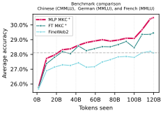

# Enhancing Multilingual LLM Pretraining with Model-Based Data Selection

This is the codebase for our paper [*Enhancing Multilingual LLM Pretraining with Model-Based Data Selection*](https://arxiv.org/abs/2502.10361).

**Abstract:**
> Dataset curation has become a basis for strong large language model (LLM) performance. While various rule-based filtering heuristics exist for English and multilingual datasets, model-based filtering techniques have primarily focused on English. To address the disparity stemming from limited research on non-English languages, we propose a model-based filtering framework for multilingual datasets that aims to identify a diverse set of structured and knowledge-rich samples. Our approach emphasizes transparency, simplicity, and efficiency, leveraging Transformer- and FastText-based classifiers to ensure the broad accessibility of our technique and data. We conduct comprehensive ablation studies on the FineWeb-2 web crawl dataset across diverse language families, scripts, and resource availability to demonstrate the effectiveness of our method. Training a 1B-parameter Llama model for 70B and 119B tokens, our approach can match the baseline MMLU score with as little as 15\% of the training tokens, while also improving across other benchmarks. These findings provide strong evidence for the generalizability of our approach to other languages. As a result, we extend our framework to 20 languages for which we release the refined pretraining datasets.



**Figure**: Pretraining benchmark performance (average accuracy) measured on Chinese (CMMLU), German (MMLU), and French (MMLU), while training for 119B tokens, comparing the baseline FineWeb-2 dataset against data filtered using our FastText (*FT*) and Transformer Multi-Layer Perceptron (*MLP*) embedding-based filtering methods trained on our data mixture *MKC<sup>+</sup>*. When using our approaches, the data retention rates are set to 10%.

We release the dataset resulting from our best approach (*MLP MKC<sup>+</sup>* with a 10% retention rate) for 20 languages as [FineWeb2-HQ](https://huggingface.co/datasets/epfml/FineWeb2-HQ) on HuggingFace.

In addition, we release the FineWeb2 dataset with XLM-RoBERTa embeddings, which can be used for multilingual research, as [FineWeb2-embedded](https://huggingface.co/datasets/epfml/FineWeb2-embedded) on HuggingFace.

# Quickstart

The codebase relies on the [`datatrove`](https://github.com/huggingface/datatrove) library.

We provide an example of the *MLP MKC<sup>+</sup>* dataset creation with a 10% retention rate for the French language (`fra_Latn`).

Create a conda environment and install the package: 

```bash
conda create -n env python=3.10
conda activate env
pip install -e .
```

Create the *MKC<sup>+</sup>* dataset:

```bash
cd data
python generate_dataset.py --output-dir ./datasets/ --language-mapping ../assets/language_mapping.csv --fineweb2-path /path/to/fineweb2/data/
```

Compute the embeddings for the generated dataset:
```bash
python compute_embeddings.py --reader-type jsonl --input-dir ./datasets/fra_Latn/train_80.jsonl --output-dir ./datasets-embedded/fra_Latn/train_80
python compute_embeddings.py --reader-type jsonl --input-dir ./datasets/fra_Latn/valid_10.jsonl --output-dir ./datasets-embedded/fra_Latn/valid_10
python compute_embeddings.py --reader-type jsonl --input-dir ./datasets/fra_Latn/test_10.jsonl --output-dir ./datasets-embedded/fra_Latn/test_10
```

Train the *MLP* model on *MKC<sup>+</sup>* dataset:
```bash
python train_mlp.py --dataset-dir ./datasets-embedded/fra_Latn/ --output-path ./models/fra_Latn.pt
```

Compute the embeddings for the FineWeb2 dataset (or use the [FineWeb2-embedded](https://huggingface.co/datasets/epfml/FineWeb2-embedded) dataset):
```bash
python compute_embeddings.py --input-dir /path/to/fineweb2/data/fra_Latn/train --output-dir ./fineweb2-embedded/fra_Latn
```

Run the filtering:
```bash
python filter_mlp.py  --input-dir ./fineweb2-embedded/fra_Latn --classifier-path ./models/fra_Latn.pt --output-dir ./fineweb2-hq/fra_Latn --retention-rate 0.1
```

The resulting dataset will be saved in the `fineweb2-hq` folder.

In order to train and evaluate an LLM using the data, we provide the configs for [`nanotron`](https://github.com/huggingface/nanotron) and [`lighteval`](https://github.com/huggingface/lighteval) in `training` and `evaluation` folders.

# Citation information

```
@article{messmer2025multilingdatacomp,
  title={Enhancing Multilingual LLM Pretraining with Model-Based Data Selection},
  author={Bettina Messmer and Vinko Sabolčec and Martin Jaggi},
  journal={arXiv},
  year={2025},
  url={https://arxiv.org/abs/2502.10361},
}
```
